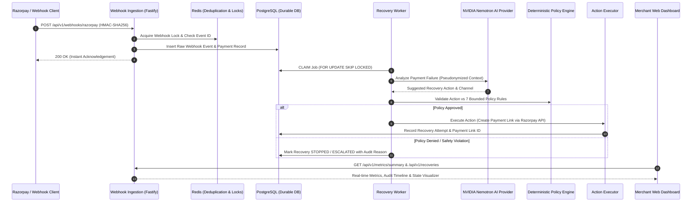

# PayRecover AI 💳🤖

**AI-Assisted Autonomous Revenue Recovery System for Failed Payments**

[](https://www.typescriptlang.org/)
[](https://www.fastify.io/)
[](https://reactjs.org/)
[](https://vitejs.dev/)
[](https://www.postgresql.org/)
[](https://redis.io/)
[](https://turbo.build/)
[](https://biomejs.dev/)
[](https://vitest.dev/)
[]()
[]()

> Developed for **Razorpay AI Buildathon — Track 3: AI Revenue Recovery**

---

## 🌟 Overview

**PayRecover AI** is an enterprise-grade revenue recovery system designed to automatically diagnose, handle, and recover failed payment transactions. By combining **NVIDIA Nemotron LLM intelligence** with a **deterministic policy engine** and **bounded action execution**, PayRecover AI safely automates recovery workflows while guaranteeing absolute financial control and merchant data safety.

### 🛡️ System Guarantees & Safety Architecture

| Principle | Guarantee | Implementation |
|---|---|---|
| **Durable Source of Truth** | Financial state & history are strictly transactional. | PostgreSQL 16 via Kysely (Redis is fast-path cache only). |
| **AI is Advisory Only** | AI recommendations are strictly bounded suggestions. | Pure function `PolicyEngine` validates AI output before any action is executed. AI **never** computes or modifies transaction amounts. |
| **Financial Authority** | Payment amounts & currencies are derived strictly from database. | `ActionExecutor` pulls monetary authority directly from PostgreSQL payment records. |
| **Idempotency & Concurrency** | Webhooks & job actions are safe against retries & races. | Dual-layer Redis fast-path locks + PostgreSQL `FOR UPDATE SKIP LOCKED` atomic job worker. |
| **PII & Secret Protection** | Customer identity & sensitive keys never leave the system. | HMAC-SHA256 pseudonymization for customer identity; secret redaction in logs/audits. |
| **Zero Paid Dependencies** | 100% free stack for complete offline & production testing. | Local Postgres/Redis, NVIDIA hosted inference API (free tier), Razorpay Test Mode (`rzp_test_*`). |

---

## 🏗️ Architecture & Data Flow



---

## 📁 Repository Structure

```
payrecover-ai/
├── apps/
│   ├── api/                    # Fastify backend service (Port 3000)
│   │   └── src/
│   │       ├── config/         # Environment validation (Zod schema)
│   │       ├── database/       # Kysely client & migrations runner
│   │       ├── demo/           # CLI demo runner & seeding script
│   │       ├── middleware/     # Auth (X-Merchant-Key) & Rate Limiters
│   │       ├── observability/  # Audit logger & Metrics aggregator
│   │       ├── recovery/       # State machine, Worker, Reconciler, Job Queue
│   │       └── routes/         # Webhook, Recoveries, Metrics, Health routes
│   └── web/                    # React + Vite Merchant Dashboard (Port 5173)
│       └── src/
│           ├── components/     # Metrics cards, Recovery table, State flow visualizer
│           └── App.tsx         # Main UI Dashboard layout & polling client
├── packages/
│   └── shared/                 # Shared domain logic & type definitions
│       └── src/
│           ├── domain/         # Deterministic Policy Engine & State definitions
│           └── providers/      # Razorpay client, AI provider (Nemotron/Mock)
├── database/                   # PostgreSQL migrations & Kysely schema types
│   └── migrations/             # 001_initial_schema, 002_add_jobs, 003_notifications
├── evaluation/                 # 26-scenario synthetic evaluation framework
│   ├── runner.ts               # CLI test harness runner
│   └── cases/                  # Deterministic synthetic test cases
├── docs/                       # Specifications & Master Documentation
│   ├── MASTER_SPECIFICATION_2.1.md
│   └── MASTER_SPECIFICATION_2.1.1.md
├── docker-compose.yml          # Local PostgreSQL 16 & Redis 7 stack
├── .env.example                # Template environment variable setup
├── package.json                # Turborepo workspace configuration
└── vitest.config.ts            # Monorepo test runner configuration
```

---

## ⚡ Quick Start & Setup

### Prerequisites

- **Node.js** ≥ 20.x
- **npm** ≥ 10.x
- **Docker** and **Docker Compose** (for PostgreSQL 16 & Redis 7)

### 1. Clone & Install Dependencies

```bash
git clone https://github.com/sirshivansh/payrecover-ai.git
cd payrecover-ai
npm install
```

### 2. Configure Environment Variables

```bash
cp .env.example .env.local
```

> Default values in `.env.example` are pre-configured for instant local development out of the box!

### 3. Start Infrastructure Stack

```bash
docker compose up -d
```

Verify that both `payrecover-db` and `payrecover-redis` containers are healthy:

```bash
docker compose ps
```

### 4. Run Database Migrations

```bash
npm run db:migrate
```

### 5. Launch Development Stack (API + Web Dashboard)

```bash
npm run dev
```

- **Backend API**: `http://localhost:3000`
- **Merchant Web Dashboard**: `http://localhost:5173`

---

## 🧪 Testing & Verification

PayRecover AI includes a multi-tiered test suite ensuring full code reliability, type safety, security hardening, and scenario evaluation.

```bash
# Run complete test suite (199 unit & integration tests across all workspaces)
npm run test

# Run TypeScript strict type verification
npm run type-check

# Run Biome linter checks
npm run lint

# Build all workspace packages
npm run build
```

### 🎯 26-Scenario Synthetic Evaluation Framework

Run the deterministic 26-scenario evaluation suite to verify system performance across edge cases (timeouts, rate limits, PII protection, duplicate webhooks, policy violations, and terminal states):

```bash
npm run evaluate
```

**Evaluation Results Summary:**
```
==================================================
PAYRECOVER AI — SYNTHETIC EVALUATION REPORT
==================================================
✅ PASS | Case 01: 1. Recoverable failed payment
✅ PASS | Case 02: 2. Already captured payment
✅ PASS | Case 03: 3. Refunded payment
✅ PASS | Case 04: 4. Missing customer contact
✅ PASS | Case 05: 5. Amount above max threshold
✅ PASS | Case 06: 6. Maximum attempts exceeded
...
✅ PASS | Case 25: 25. Financial Metrics Payment Identity Deduplication
✅ PASS | Case 26: 26. Terminal State Immutability
--------------------------------------------------
Total Cases: 26 | Passed: 26 | Failed: 0 | Verdict: PASS
==================================================
```

---

## 🎬 Demo Rehearsal & Live Verification

### Offline CLI End-to-End Demo Rehearsal

Run the complete CLI automated rehearsal flow offline without external dependencies:

```bash
# 1. Setup & verify environment check
npm run demo:setup

# 2. Seed deterministic payment failure data
npm run demo:seed

# 3. Execute recovery orchestration loop
npm run demo:run

# 4. Verify recovery outcomes, metrics & audit logs
npm run demo:verify

# 5. Cleanly reset demo state
npm run demo:reset
```

### Live Razorpay Test Mode Integration

PayRecover AI supports full live HTTPS integration with Razorpay Test Mode API (`api.razorpay.com`) and live public Webhook tunneling (e.g. via `zrok` or `ngrok`):

1. **Expose Local API Publicly:**
   ```bash
   zrok share public localhost:3000
   ```
2. **Configure Webhook URL in Razorpay Dashboard:**
   Set Webhook URL to `https://<your-zrok-domain>/api/v1/webhooks/razorpay` with event selection:
   - `payment.failed`
   - `payment_link.paid`
3. **Trigger Real Test Mode Payment:**
   Generate a test failure or test payment link payment. Watch real-time recovery state updates, payment link generation (`https://rzp.io/rzp/...`), and metric updates in the Web Dashboard (`http://localhost:5173`)!

---

## 📊 Completed Implementation Roadmap

All 19 development phases defined in the specification are fully implemented, tested, and verified:

| Phase | Description | Status |
|---|---|:---:|
| **Phase 0** | Workspace & Tooling Initialization (Turborepo, Biome, Vitest) | ✅ |
| **Phase 1** | Database Schema & Kysely Migrations (PostgreSQL 16) | ✅ |
| **Phase 2** | Razorpay Webhook Ingestion (HMAC-SHA256, PII Pseudonymization) | ✅ |
| **Phase 3** | Payment State Service & Razorpay API Integration | ✅ |
| **Phase 4** | Recovery State Machine & RecoveryManager CRUD Operations | ✅ |
| **Phase 5** | Redis Idempotency / Locks & Dual-Layer Infrastructure | ✅ |
| **Phase 6** | Deterministic Policy Engine (7 Bounded Ordered Rules) | ✅ |
| **Phase 7** | AI Provider Abstraction & NVIDIA Nemotron LLM Provider | ✅ |
| **Phase 8** | Action Executor & Policy-Gated Bounded Actions | ✅ |
| **Phase 9** | Async Recovery Job Queue & `FOR UPDATE SKIP LOCKED` Worker | ✅ |
| **Phase 10**| Evaluation Engine & Deterministic Outcome Verification | ✅ |
| **Phase 11**| External Reconciliation & 21-Case Evaluation CLI Runner | ✅ |
| **Phase 12**| Observability, Audit Trail & Structured Metrics API Routes | ✅ |
| **Phase 13**| React + Vite Merchant Operations Web Dashboard | ✅ |
| **Phase 14**| Notification Service & Idempotent Merchant Alerting | ✅ |
| **Phase 16**| Synthetic Evaluation Framework Verification Harness | ✅ |
| **Phase 17**| Rate Limiting, Security Hardening & Concurrency Stress Suite | ✅ |
| **Phase 18**| Razorpay Test Mode Runtime Enforcement & Safety Gates | ✅ |
| **Phase 19**| Live Razorpay Test Mode E2E Verification & Production Readiness | ✅ |

---

## 📜 License & Acknowledgments

This project is built for the **Razorpay AI Buildathon (Track 3: AI Revenue Recovery)**.
Distributed under the MIT License.
